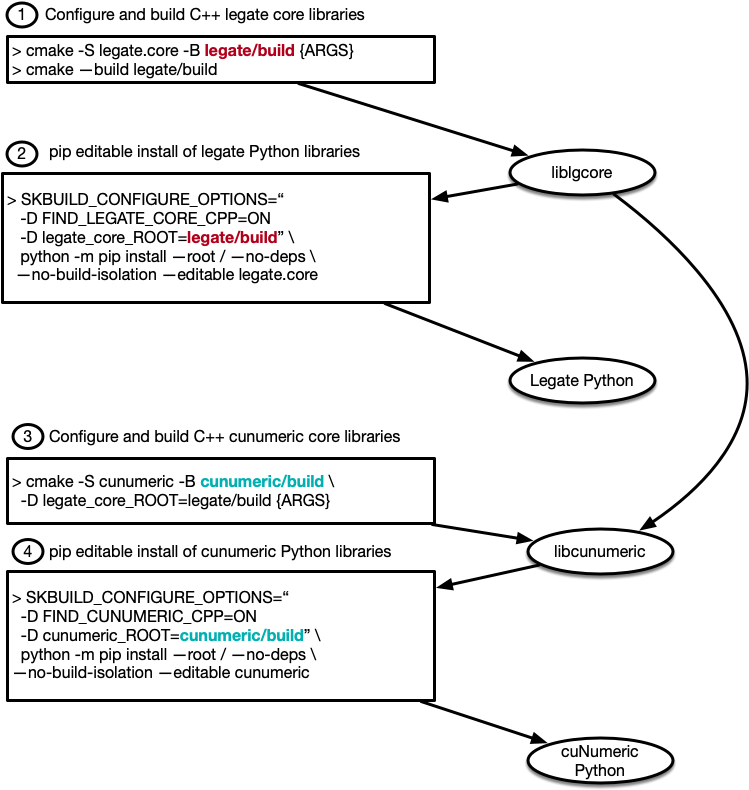

<!--
Copyright 2021-2022 NVIDIA Corporation

Licensed under the Apache License, Version 2.0 (the "License");
you may not use this file except in compliance with the License.
You may obtain a copy of the License at

    http://www.apache.org/licenses/LICENSE-2.0

Unless required by applicable law or agreed to in writing, software
distributed under the License is distributed on an "AS IS" BASIS,
WITHOUT WARRANTIES OR CONDITIONS OF ANY KIND, either express or implied.
See the License for the specific language governing permissions and
limitations under the License.

-->

# Overview

The build system is designed to enable two different modes of use:
1. Simple `pip install` for users
2. Highly customizable incremental builds for developers

We review each of these modes with examples.


# Building for Users

## Using install.py

For releases <= 22.07, the main method for building cuNumeric was the `install.py` script.
Although the underlying implementation has significantly changed, `install.py` still supports the
same usage and same set of flags. For a full list of flags, users can run:

```
$ ./install.py --help
```

## Using Conda
 
cuNumeric can be installed using Conda by pointing to the required channels (`-c`):

```
conda install -c nvidia -c conda-forge -c legate legate-core
```

## Using pip

cuNumeric is not yet registered in a standard pip repository. However, users can still use the 
pip installer to build and install cuNumeric. After downloading or cloning the cunumeric source,
users can run the following in the cunumeric folder:

```
$ pip install .
```
or
```
$ python3 -m pip install .
```

This will install cuNumeric in the standard packages directory for the environment Python.
Note: This is currently not sufficient for running cuNumeric programs. cuNumeric relies
on the `legate` launcher from Legate core, which must be installed separately.
For details on installing Legate, consult the [Legate repository](https://github.com/nv-legate/legate.core).

### Advanced Customization

If users need to customize details of the underlying CMake build, they can pass
CMake flags through the `SKBUILD_CONFIGURE_OPTIONS` environment variable:

```
$ SKBUILD_CONFIGURE_OPTIONS="-D Legion_USE_CUDA:BOOL=ON" \
  pip install .
```
An alternative syntax using `setup.py` with `scikit-build` is
```
$ python setup.py install -- -DLegion_USE_CUDA:BOOL=ON
```

# Building for Developers

## Overview

pip uses [scikit-build](https://scikit-build.readthedocs.io/en/latest/)
in `setup.py` to drive the build and installation.  A `pip install` will trigger three general actions:

1. CMake build and installation of C++ libraries
2. CMake generation of configuration files and build-dependent Python files
3. pip installation of Python files

The CMake build can be configured independently of `pip`, allowing incremental C++ builds directly through CMake.
This simplifies rebuilding `libcunumeric.so` either via command-line or via IDE.
After building the C++ libraries, the `pip install` can be done in "editable" mode using the `-e` flag.
This configures the Python site packages to import the Python source tree directly.
The Python source can then be edited and used directly for testing without requiring a `pip install`.

## Example

There are several examples in the `scripts` folder. We walk through the steps in the `build-with-legate-separately-no-install.sh` here.
We assume a pre-existing Legate CUDA build. For details on building Legate, consult the [Legate repository](https://github.com/nv-legate/legate.core).
First, the CMake build needs to be configured:

```
$ cmake -S . -B build -GNinja -D legate_core_ROOT:STRING=path/to/legate/build
```

We point cuNumeric to the Legate *build* tree, not an installation.
This generates all build-dependent headers and Python files.
Once configured, we can build the C++ libraries:

```
$ cmake --build build
```

This will invoke Ninja (or make) to execute the build.
Once the C++ libraries are available, we can do an editable (development) pip installation.

```
$ SKBUILD_BUILD_OPTIONS="-D FIND_CUNUMERIC_CPP=ON -D cunumeric_ROOT=$(pwd)/build" \
  python3 -m pip install \
  --root / --no-deps --no-build-isolation 
  --editable .
```

The Python source tree and CMake build tree are now available with the environment Python 
for running cuNumeric programs. The diagram below illustrates the 
complete workflow for building both Legate core and cuNumeric.




