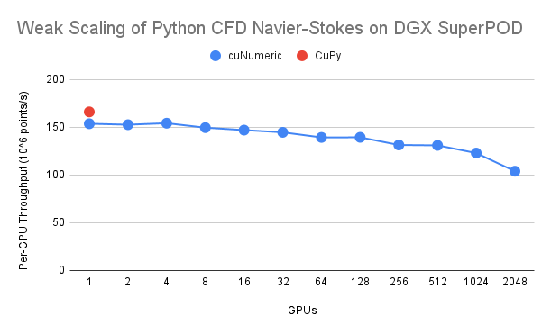

<!--
Copyright 2021-2022 NVIDIA Corporation

Licensed under the Apache License, Version 2.0 (the "License");
you may not use this file except in compliance with the License.
You may obtain a copy of the License at

    http://www.apache.org/licenses/LICENSE-2.0

Unless required by applicable law or agreed to in writing, software
distributed under the License is distributed on an "AS IS" BASIS,
WITHOUT WARRANTIES OR CONDITIONS OF ANY KIND, either express or implied.
See the License for the specific language governing permissions and
limitations under the License.

-->

# cuNumeric

cuNumeric is a [Legate](https://github.com/nv-legate/legate.core) library
that aims to provide a distributed and accelerated drop-in replacement for the
[NumPy API](https://numpy.org/doc/stable/reference/) on top of the
[Legion](https://legion.stanford.edu) runtime. Using cuNumeric you do things like run
[the final example of the Python CFD course](https://github.com/barbagroup/CFDPython/blob/master/lessons/15_Step_12.ipynb)
completely unmodified on 2048 A100 GPUs in a [DGX SuperPOD](https://github.com/barbagroup/CFDPython/blob/master/lessons/15_Step_12.ipynb) and achieve good weak scaling.



cuNumeric works best for programs that have very large arrays of data
that cannot fit in the memory of a single GPU or a single node and need
to span multiple nodes and GPUs. While our implementation of the current
NumPy API is still incomplete, programs that use unimplemented features
will still work (assuming enough memory) by falling back to the
canonical NumPy implementation.

If you have questions, please contact us at legate(at)nvidia.com.

1. [Installation](#installation)
1. [Dependencies](#dependencies)
1. [Building from Source](#building-from-source)
1. [Usage and Execution](#usage-and-execution)
1. [Supported and Planned Features](#supported-and-planned-features)
1. [Supported Types and Dimensions](#supported-types-and-dimensions)
1. [Documentation](#documentation)
1. [Future Directions](#future-directions)
1. [Contributing](#contributing)
1. [Known Bugs](#known-bugs)

## Installation

cuNumeric is available [on conda](https://anaconda.org/legate/cunumeric):

```
conda install -c nvidia -c conda-forge -c legate cunumeric
```
The conda package is compatible with CUDA >= 11.4 (CUDA driver version >= r470),
and Volta or later GPU architectures.

Docker image build scripts, as well as specialized install scripts for
supported clusters are available on the
[quickstart](https://github.com/nv-legate/quickstart) repo.

Read on for general instructions on building cuNumeric from source.

## Dependencies

Users must have a working installation of the
[Legate Core](https://github.com/nv-legate/legate.core)
library prior to installing cuNumeric.

cuNumeric requires the following:

  - Python >= 3.8
  - [CUDA](https://developer.nvidia.com/cuda-downloads) >= 10.2
  - GNU Make
  - C++17 compatible compiler (g++, clang, or nvc++)
  - Fortran compiler (for building OpenBLAS; not necessary if you provide a pre-built version of OpenBLAS)
  - the Python packages listed in any one of the conda environment files:
    - `conda/environment-test-3.8.yml`
    - `conda/environment-test-3.9.yml`
    - `conda/environment-test-3.10.yml`

See the [corresponding section](https://github.com/nv-legate/legate.core#dependencies)
on the Legate Core instructions for help on installing the required Python packages
using conda.

cuNumeric is tested and guaranteed to be compatible with Volta and later GPU
architectures. You can use cuNumeric with Pascal GPUs as well, but there could
be issues due to lack of independent thread scheduling. Please report any such
issues on GitHub.

## Building from Source

Installation can be done the `install.py` script.
For releases >= 22.10, `pip install` is now available.
The most common installation command is:

```
./install.py --with-core <path-to-legate-core-installation>
```

This will build cuNumeric against the Legate Core installation and then
install cuNumeric into the same location.

If Legate Core has been installed with CUDA support, a working cuTENSOR
installation must also be provided to the installation command with the
`--with-cutensor` option:
```
./install.py --with-core <path-to-legate-core-installation> --with-cutensor <path-to-cutensor-installation>
```

You can also specify an installation of [OpenBLAS](https://www.openblas.net/)
to use for the build. If you already have an installation of OpenBLAS on your
machine, you can inform the installation script using the `--with-openblas`
option:

```
./install.py --with-openblas <path-to-OpenBLAS>
```

Advanced users can also invoke `install.py --help` to see options for
configuring cuNumeric by invoking the `install.py` script directly.
More information on building - including development workflows - can be found
in the [build instructions](BUILD.md)


## Usage and Execution

Using cuNumeric as a replacement for NumPy is easy. Users only need
to replace:

```
import numpy as np
```

with:

```
import cunumeric as np
```

These programs can then be run by the Legate driver script described in the
[Legate Core](https://github.com/nv-legate/legate.core) documentation.

```
legate cunumeric_program.py
```

For execution with multiple nodes (assuming Legate Core is installed with GASNet support)
users can supply the `--nodes` option. For execution with GPUs, users can use the
`--gpus` flags to specify the number of GPUs to use per node. We encourage all users
to familiarize themselves with these resource flags as described in the Legate Core
documentation or simply by passing `--help` to the `legate` driver script.

You can use `test.py` to run the test suite. This script will invoke the `legate`
driver script automatically. Check out `test.py --help` for further options.

## Supported and Planned Features

cuNumeric is currently a work in progress and we are gradually adding support for
additional NumPy operators. Unsupported NumPy operations will provide a
warning that we are falling back to canonical NumPy. Please report unimplemented
features that are necessary for attaining good performance so that we can triage
them and prioritize implementation appropriately. The more users that report an
unimplemented feature, the more we will prioritize it. Please include a pointer
to your code if possible too so we can see how you are using the feature in context.

## Supported Types and Dimensions

cuNumeric currently supports the following NumPy types: `float16`, `float32`,
`float64`, `int16`, `int32`, `int64`, `uint16`, `uint32`, `uint64`, `bool`,
`complex64`, and `complex128`.

cuNumeric supports up to 4D arrays by default, you can adjust this setting by
installing legate.core with a larger `--max-dim`.

## Documentation

A complete list of available features can is provided in the [API
reference](https://nv-legate.github.io/cunumeric/api/index.html).

## Future Directions

There are three primary directions that we plan to investigate
with cuNumeric going forward:

* More features: we plan to identify a few key lighthouse applications
  and use the demands of these applications to drive the addition of
  new features to cuNumeric.
* We plan to add support for sharded file I/O for loading and
  storing large data sets that could never be loaded on a single node.
  Initially this will begin with native support for [h5py](https://www.h5py.org/)
  but will grow to accommodate other formats needed by our lighthouse
  applications.
* Strong scaling: while cuNumeric is currently implemented in a way that
  enables weak scaling of codes on larger data sets, we would also like
  to make it possible to strong-scale Legate applications for a single
  problem size. This will require leveraging some of the more advanced
  features of Legion from inside the Python interpreter.

We are open to comments, suggestions, and ideas.

## Contributing

See the discussion of contributing in [CONTRIBUTING.md](CONTRIBUTING.md).

## Known Issues

 * When using certain operations with high scratch space requirements (e.g.
   `einsum` or `convolve`) you might run into the following error:
   ```
   LEGION ERROR: Failed to allocate DeferredBuffer/Value/Reduction in task [some task] because [some memory] is full. This is an eager allocation ...
   ```
   Currently, Legion splits its memory reservations between two pools: the
   "deferred" pool, used for allocating cuNumeric `ndarray`s, and the "eager"
   pool, used for allocating scratch memory for operations. The above error
   message signifies that not enough memory was available for an operation's
   scratch space requirements. You can work around this by allocating more
   memory overall to cuNumeric (e.g. adjusting `--sysmem`, `--numamem` or
   `--fbmem`), and/or by adjusting the split between the two pools (e.g. by
   passing `-lg:eager_alloc_percentage 60` on the command line to allocate 60%
   of memory to the eager pool, up from the default of 50%).
 * cuNumeric can exercise a bug in OpenBLAS when it is run with
   [multiple OpenMP processors](https://github.com/xianyi/OpenBLAS/issues/2146)
 * On Mac OSX, cuNumeric can trigger a bug in Apple's implementation of libc++.
   The [bug](https://bugs.llvm.org/show_bug.cgi?id=43764) has since been fixed but
   likely will not show up on most Apple machines for quite some time. You may have
   to manually patch your implementation of libc++. If you have trouble doing this
   please contact us and we will be able to help you.
